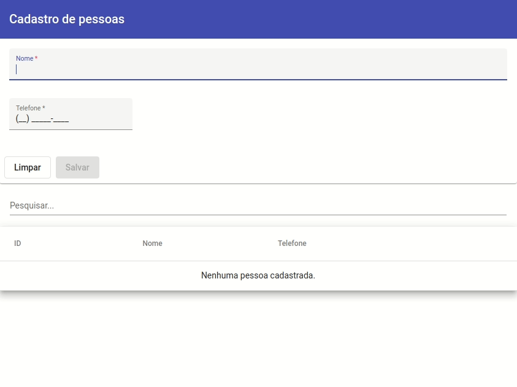
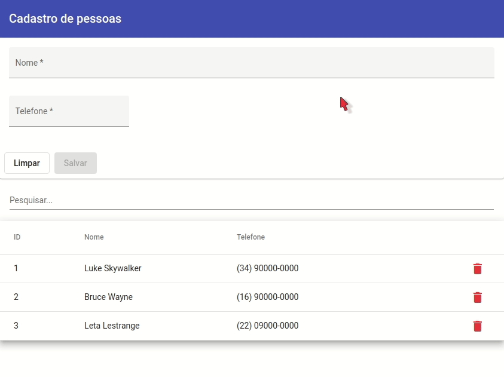
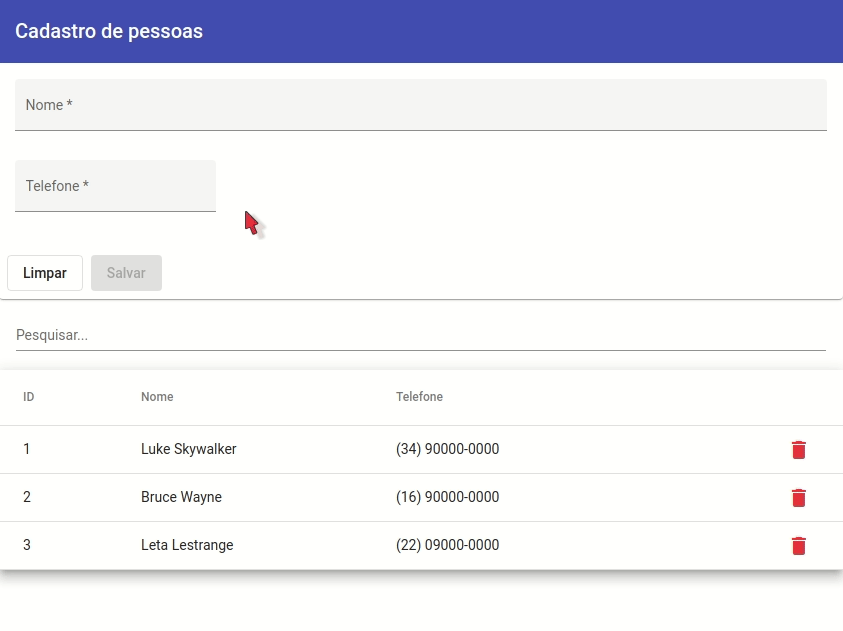
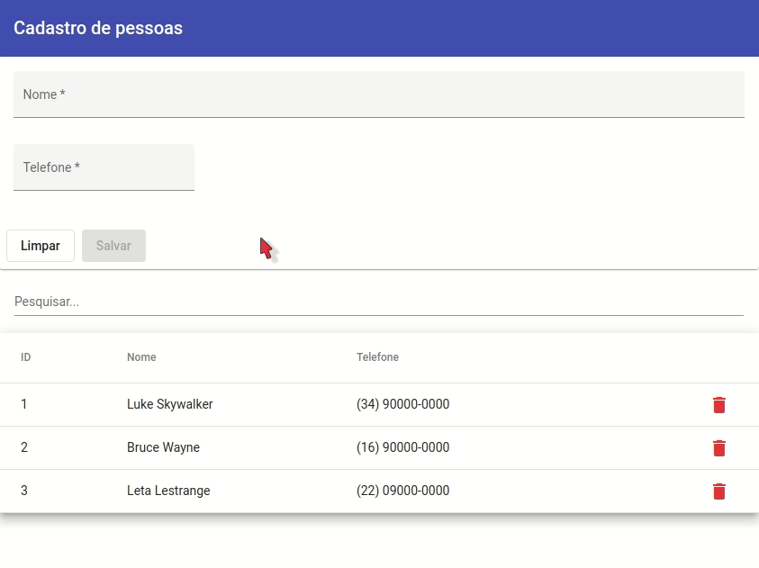

<h1 align="center">Cadastro de Pessoas</h1>

<p align="center">
    
    
</p>

- [Descrição do Projeto](#descrição-do-projeto)
- [Funcionalidades da Aplicação](#funcionalidades-da-aplicação)
- [Instalação e execução](#instalação-e-execução)
- [Tecnologias utilizadas](#tecnologias-utilizadas)
- [Pessoas Desenvolvedoras do Projeto](#pessoas-desenvolvedoras-do-projeto)
- [Licença](#licença)

## Descrição do Projeto

Cadastro de pessoas é um projeto simples de front-end desenvolvido em Angular e Angular Material, que, como o próprio nome diz, tem como objetivo cadastrar pessoas e adicioná-las em uma lista.
<br><br>

## Funcionalidades da Aplicação

- `Cadastrar pessoa`: Para cadastrar uma pessoa, deve-se preencher o nome e o telefone, e em seguida, teclar Enter ou clicar em "Salvar".
<div align="center">
    
</div>
<br>

- `Remover pessoa`: Para remover uma pessoa, deve-se, na listagem de pessoas, clicar no botão vermelho com o símbolo de uma lixeira, e em seguida, clicar em "Sim", na caixa de diálogo que aparecerá, para confirmar a remoção.
<div align="center">
    
</div>
<br>

- `Pesquisar por pessoas`: Para pesquisar por pessoas, deve-se, na barra de pesquisa, digitar o filtro desejado, podendo ser pesquisado por ID, nome ou telefone. A barra de pesquisa funciona em tempo real, então não há necessidade de teclar Enter.
<div align="center">
    
</div>
<br>

- `Ordenar lista de pessoas`: Para ordenar a lista de pessoas, deve-se, no cabeçalho da listagem de produtos, clicar sobre a seta que aparecerá ao passar o mouse sobre o campo de ordenação desejado. Ao clicar, a seta ficará apontada para cima, o que indica ordenação crescente. Clicando novamente, a seta ficará apontada para baixo, o que indica ordenação decrescente. E ao clicar mais uma vez, a seta sumirá e a listagem não terá ordenação.
<div align="center">
    
</div>
<br><br>

## Instalação e execução

- Instala as dependências do projeto
    ```bash
    npm install
    ```
- Inicia o projeto em modo de desenvolvimento para demonstração
    ```bash
    npm start
    ```

## Tecnologias utilizadas

- ``Angular``
- ``Angular Material``

## Pessoas Desenvolvedoras do Projeto

<a href="https://www.linkedin.com/in/brenner-barbosa/">
    
</a>
<br><br>

## Licença

Este projeto está licenciado nos termos da licença MIT.
